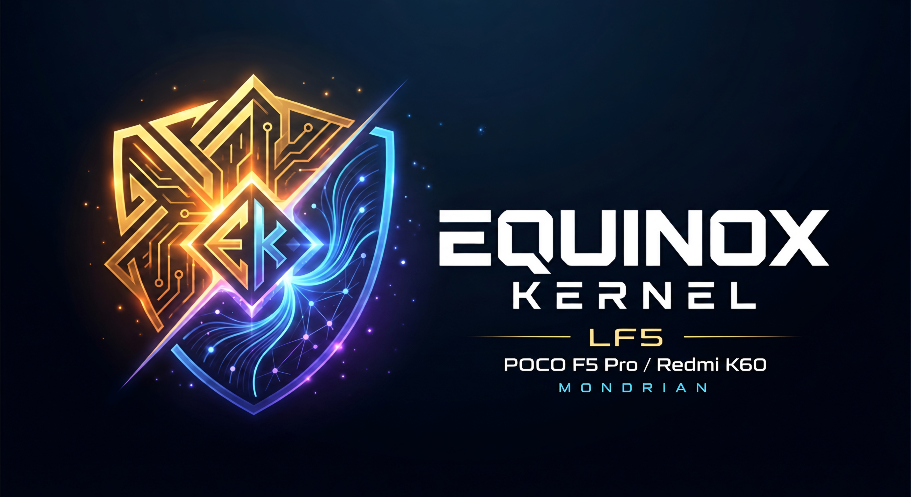

# Equinox Kernel

**POCO F5 Pro / Redmi K60** · `mondrian` · Snapdragon 8+ Gen 1

**Developer:** [LF52406](https://github.com/LF52406) · **[Download builds](../../releases)**

---

## Current Build

|  | Component | Current |
|:--:|:--|:--|
| 🐧 | **Linux** | `5.10.269-Equinox` |
| 🤖 | **Compatibility** | Android 16–17 · AOSP-based ROMs |
| ⚡ | **KernelSU-Next** | `3.4.0` |
| 🛡️ | **SUSFS** | `2.3.0` |
| 📦 | **DroidSpaces** | Supported |
| 🌐 | **TCP** | BBR available · CUBIC default |
| 🛠️ | **Toolchain** | Neutron Clang `24.0.0git` |
| ⚙️ | **Build** | Full LTO · Clang CFI · MODVERSIONS |
| 🔒 | **KMI** | Verified |

---

## Features

| Group | Included |
|:--|:--|
| **Root & hiding** | KernelSU-Next integration · SUSFS |
| **Containers** | DroidSpaces · PID namespaces · IPC / SYSVIPC |
| **Networking** | TCP BBR · runtime congestion-control switching |
| **Device** | mondrian production config · Goodix touch stability fixes |
| **Packaging** | Verified AnyKernel3 release package |

---

## Latest Changes

### Linux 5.10.269

- Updated KernelSU-Next to `3.4.0`
- Integrated SUSFS `2.3.0`
- Added DroidSpaces support
- Added and verified TCP BBR support
- Added production KMI validation
- Added verified AnyKernel3 packaging

[View full release notes](../../releases)

---

## Downloads & Flashing

Official Equinox builds are published through **GitHub Releases**.

**Current package:** `Equinox-5.10.269-mondrian.zip`  
**SHA256:** `f05af44bd3ea19a4bda167efda5b790c2b52d3733a732bafcdccc9a5c76cd60a`

Download the release asset and flash the AnyKernel3 ZIP using a compatible recovery or kernel flasher.

> GitHub-generated `Source code` archives are not flashable kernel packages.

---

## Reporting Issues

When reporting a problem, include the kernel version, a short reproduction description and relevant logs such as `dmesg`, `logcat`, `pstore / ramoops`, or watchdog / panic logs when available.

[Open an issue](../../issues)

---

## Support Development

If you find **Equinox Kernel** useful and would like to support its continued development, donations are always appreciated but entirely optional.

---

## Credits & Upstreams

- [**LineageOS/android_kernel_xiaomi_sm8450**](https://github.com/LineageOS/android_kernel_xiaomi_sm8450) — primary kernel base used by Equinox
- [**LineageOS/android_kernel_qcom_sm8450**](https://github.com/LineageOS/android_kernel_qcom_sm8450) — Qualcomm common-kernel upstream used by Equinox
- [**Android Common Kernel**](https://android.googlesource.com/kernel/common) / [**Linux Kernel**](https://www.kernel.org/) — Android kernel infrastructure and upstream Linux
- [**KernelSU-Next**](https://github.com/KernelSU-Next/KernelSU-Next) — kernel root implementation
- [**SUSFS**](https://gitlab.com/simonpunk/susfs4ksu) by **simonpunk** / [**Zhanfg/susfs4ksu**](https://github.com/Zhanfg/susfs4ksu) — SUSFS integration for Linux 5.10
- [**DroidSpaces**](https://github.com/ravindu644/Droidspaces-OSS) by **ravindu644** — container runtime and kernel requirements
- [**Neutron Toolchains**](https://github.com/Neutron-Toolchains/clang-build-catalogue) — LLVM/Clang toolchain
- [**AnyKernel3**](https://github.com/osm0sis/AnyKernel3) by **osm0sis** — flashable kernel packaging

Thanks to Qualcomm, LineageOS contributors, Android Common Kernel contributors, and the broader Linux kernel community for the upstream kernel, platform, and driver work that Equinox builds upon.

---

## License

Equinox Kernel is based on the Linux kernel and follows its licensing terms. The kernel is distributed under **GPL-2.0 WITH Linux-syscall-note**, with individual files retaining their applicable SPDX license identifiers.

See [COPYING](COPYING), [LICENSES](LICENSES/), and [Documentation/process/license-rules.rst](Documentation/process/license-rules.rst) for details.
